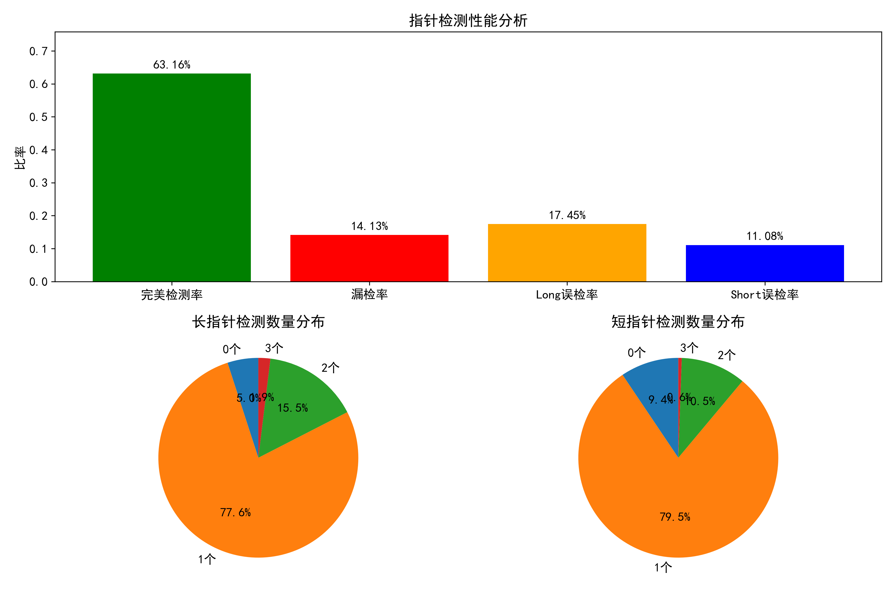
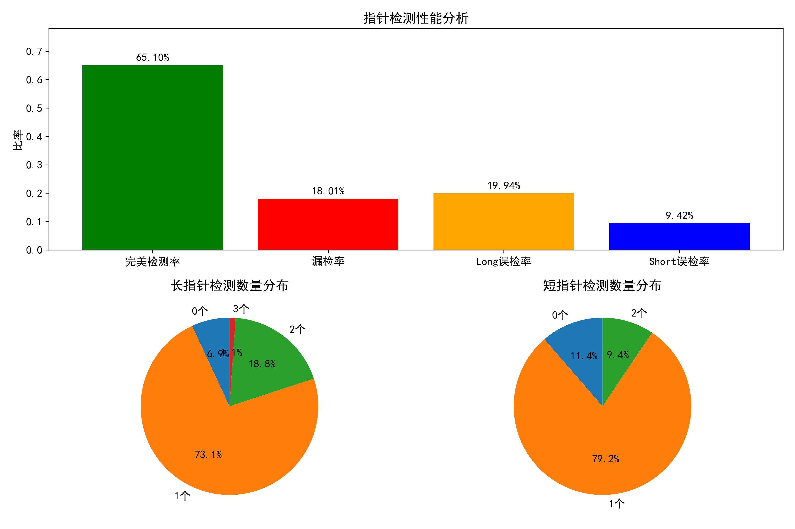
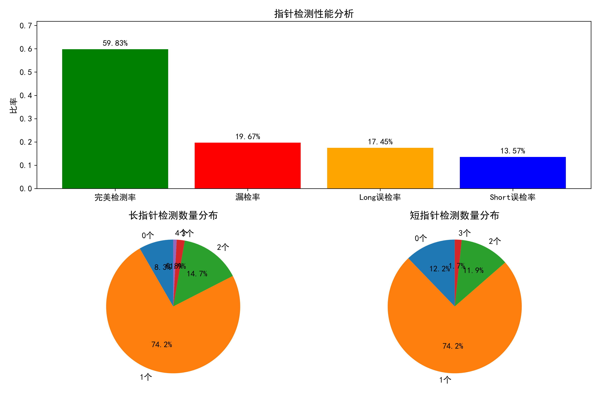

# 时钟表盘识别和读取时间

## 一、识别并截取表盘

  定义 **clock_detector** 模块:

​    使用 yolov8m-seg 模型, 识别出表盘的轮廓, 根据轮廓截取出表盘区域，保存为新的图像。

- ​    `input`: 原始图像
- ​    `output`: 只包含表盘区域的图像

## 二、表盘矫正 

  定义 **ellipse_transform** 模块:

​    使用 yolov8m-seg 模型, 识别出表盘, 取出结果中的掩码数据 result.mask.data 拟合表盘轮廓, 如果拟合结果经判断为椭圆(长短轴比例>1.08), 进行仿射变换。

- ​    `input`: 只包含表盘区域的图像

- ​    `output`: 矫正后的表盘图像


## 三、指针识别

### 训练模型
1. 制作训练数据集: 使用 labelme 标注每个表盘图像的时针(short_pointer)和分针(long_pointer), 共标注 **249** 张图像;
2. 切分数据数据集: **199** 张训练图像，**50** 张验证图像
3. 训练模型: 在 colab 分别训练 `yolov8s-seg`, `yolov8m-seg`, `yolov8l-seg` 模型


## 四、训练结果分析

### 性能指标对比表 ###

| 指标           | YOLOv8s-seg   | YOLOv8m-seg  | YOLOv8l-seg  |
| -------------- | ------------- | ------------ | ------------ |
| **边界框检测** |               |              |              |
| 精确率         | 74.2%         | 83.3% ✓      | 74.1%        |
| 召回率         | 86.4% ✓       | 77.2%        | 81.1%        |
| mAP50          | 86.9% ✓       | 85.9%        | 83.5%        |
| mAP50-95       | 69.8%         | 70.6% ✓      | 64.9%        |
| **分割掩码**   |               |              |              |
| 精确率         | 65.0%         | 80.0% ✓      | 72.0%        |
| 召回率         | 76.9% ✓       | 74.3%        | 76.0%        |
| mAP50          | 73.8%         | 80.1% ✓      | 75.1%        |
| mAP50-95       | 44.4%         | 46.8% ✓      | 44.0%        |
| **资源消耗**   |               |              |              |
| 参数量         | 11.8M ✓       | 27.2M        | 45.9M        |
| 计算量         | 42.4 GFLOPs ✓ | 110.0 GFLOPs | 220.1 GFLOPs |
| 推理速度       | 7.1ms ✓       | 15.8ms       | 22.0ms       |
| 模型大小       | 23.9MB ✓      | 54.8MB       | 91.7MB       |

## 五、predict 结果分析

### 1. 指标含义

#### 主要性能指标 ####

1. **完美检测率**
   - **定义**：模型正确检测到恰好一个长指针和一个短指针的图像比例
   - **计算方式**：`(长指针=1 且 短指针=1的图像数) / 总图像数`
   - **意义**：这是最理想的检测结果，表示模型能够准确识别时钟的两种指针，不多不少
   - **目标**：该值越接近100%越好
2. **漏检率**
   - **定义**：模型未能检测到所有应有指针的图像比例
   - **计算方式**：`(长指针=0 或 短指针=0的图像数) / 总图像数`
   - **意义**：反映了模型的召回能力不足，表示有多少图像中的指针被完全忽略
   - **目标**：该值越接近0%越好
3. **长指针误检率**
   - **定义**：模型检测到多余长指针的图像比例
   - **计算方式**：`(长指针>1的图像数) / 总图像数`
   - **意义**：反映了模型对长指针的过度识别程度
   - **目标**：该值越接近0%越好
4. **短指针误检率**
   - **定义**：模型检测到多余短指针的图像比例
   - **计算方式**：`(短指针>1的图像数) / 总图像数`
   - **意义**：反映了模型对短指针的过度识别程度
   - **目标**：该值越接近0%越好

#### 详细分析指标 ####

##### 漏检详情 #####

- **只漏检长指针**：只有长指针未被检测到的情况 `(长指针=0 且 短指针>0)`
- **只漏检短指针**：只有短指针未被检测到的情况 `(长指针>0 且 短指针=0)`
- **两类都漏检**：两种指针都未被检测到的情况 `(长指针=0 且 短指针=0)`

##### 误检详情 #####

- **长/短指针检测到2个**：过度检测到2个指针的情况
- **长/短指针检测到3个或更多**：严重过度检测的情况

### 2. 模型检测性能对比 ###

#### yolov8s-seg model 检测性能分析报告

总样本数: 361
漏检率: 14.13% (51个样本)
完美检测率: 63.16% (228个样本)
Long pointer误检率: 17.45% (63个样本)
Short pointer误检率: 11.08% (40个样本)

漏检详情:
- 只漏检Long pointer: 17个样本
- 只漏检Short pointer: 33个样本
- 两类都漏检: 1个样本

误检详情:
- Long pointer检测到2个: 56个样本
- Long pointer检测到3个或更多: 7个样本
- Short pointer检测到2个: 38个样本
- Short pointer检测到3个或更多: 2个样本

#### yolov8m-seg model 检测性能分析报告 ####

总样本数: 361
漏检率: 18.01% (65个样本)
完美检测率: 65.10% (235个样本)
Long pointer误检率: 19.94% (72个样本)
Short pointer误检率: 9.42% (34个样本)

漏检详情:
- 只漏检Long pointer: 24个样本
- 只漏检Short pointer: 40个样本
- 两类都漏检: 1个样本

误检详情:
- Long pointer检测到2个: 68个样本
- Long pointer检测到3个或更多: 4个样本
- Short pointer检测到2个: 34个样本
- Short pointer检测到3个或更多: 0个样本

#### yolov8l-seg model 检测性能分析报告 ####

总样本数: 361
漏检率: 19.67% (71个样本)
总样本数: 361
漏检率: 19.67% (71个样本)
漏检率: 19.67% (71个样本)
完美检测率: 59.83% (216个样本)
Long pointer误检率: 17.45% (63个样本)
Short pointer误检率: 13.57% (49个样本)

漏检详情:
- 只漏检Long pointer: 27个样本
- 只漏检Short pointer: 41个样本
- 两类都漏检: 3个样本

误检详情:
- Long pointer检测到2个: 53个样本
- Long pointer检测到3个或更多: 10个样本
- Short pointer检测到2个: 43个样本
- Short pointer检测到3个或更多: 6个样本

<div style="flex:32%">
    
        <p align="center" style="font-weight:bold; font-size:30px;">YOLOv8s-seg</p>
</div>


<div style="flex:32%">
    
    <p align="center" style="font-weight:bold; font-size:30px;">YOLOv8m-seg</p>
</div>


<div style="flex:32%;">
    <center>
        
        <p align="center" style="font-weight:bold; font-size:30px;">YOLOv8l-seg</p>
    </center>
</div>

### 3. 模型选择 ###

因为 **<u>yolov8s-seg</u>** 模型的 ==漏检率== 最低，所以后续检测基于 **<u>yolov8s-seg</u>** 模型。

## 六、指针角度与夹角计算 ##

### 1. 目标 ###

对于每张表盘图像，基于训练好的YOLO分割模型的预测结果，计算以下三项：

1. **长指针角度**（long_pointer_angle）：相对于表盘中心，顺时针，从12点方向为 0°
2. **短指针角度**（short_pointer_angle）
3. **两指针夹角**（angle_between）：最小夹角，范围为 0–180°

### 2. 步骤说明 ###

#### Step 1：过滤检测结果 ####

从 `result.boxes` 中提取预测框，并按类别分为：

- **长指针**（long_pointer）
- **短指针**（short_pointer）

处理规则：

- 如果某一类指针 **数量为 0**，**跳过该图像**（漏检）；
- 如果某一类有多个结果，选 **置信度最高的那个**框参与后续计算。

#### Step 2：定义表盘中心区域 ####

将图像中心 ±10% 的范围定义为**中心区域**，用于辅助判断方向：

```python
img_center = (img_width / 2, img_height / 2)
center_box = [
    (img_center[0] - 0.1 * img_width, img_center[1] - 0.1 * img_height),
    (img_center[0] + 0.1 * img_width, img_center[1] + 0.1 * img_height)
]
```

#### Step 3：获取指针矩形框顶点 ####

对于每个保留下来的指针框（长或短）：

1. 从分割轮廓或 bbox 构造旋转矩形：

   ```python
   rect = cv2.minAreaRect(points)
   box_points = cv2.boxPoints(rect)  # 得到4个顶点坐标
   ```

2. 计算矩形中心点（`rect_center`）：

   ```python
   rect_center = np.mean(box_points, axis=0)
   ```

#### Step 4：计算指针方向向量 ####

##### 默认方法：对角线比较法 #####

1. 构造两条对角线：`(p1, p3)` 与 `(p2, p4)`

2. 每条线选一个端点，计算其与**图像中心**的距离

3. 取距离更远的端点作为“指向端”，构造方向向量：

   ```python
   dir_vector = far_point - rect_center
   ```

4. 若两个端点与图像中心距离差 < 10 像素，方向不明确 → 切换备用方法

##### 回退方法：长边方向法 #####

1. 使用 `cv2.minAreaRect()` 获取矩形长边方向
2. 判断长边两端哪个端点更远离图像中心
3. 构造方向向量：从矩形中心指向那个更远端点

#### Step 5：方向向量转角度 ####

将方向向量转为角度（相对表盘）：

```python
dx, dy = dir_vector
angle = np.degrees(np.arctan2(dx, -dy))  # y轴向下需取负
angle = (angle + 360) % 360  # 归一化为 0~360 度
```

#### Step 6：计算指针夹角 ####

```python
diff = abs(long_angle - short_angle)
angle_between = min(diff, 360 - diff)  # 最小夹角，范围 0~180 度
```

#### 输出格式（每张图像） ####

```json
{
  "image": "img_216.jpg",
  "long_angle": 28.35,
  "short_angle": 95.20,
  "angle_between": 66.85
}
```

#### 结果可视化 ####

在输入图像上绘制：

- 图像中心点（小圆）
- 指针方向箭头
- 角度标注文字
- 夹角标注

## 七、最终结果 ##

<div style="display:flex; justify-content: space-between;">
  <div style="flex:32%; margin-right:1%">
    
  </div>
  <div style="flex:32%; margin-right:1%">
    
  </div>
</div>
<div style="display:flex; justify-content: space-between;">
  <div style="flex:32%; margin-right:1%">
    
  </div>
  <div style="flex:32%; margin-right:1%">
    
  </div>
</div>
<div style="display:flex; justify-content: space-between;">
  <div style="flex:32%; margin-right:1%">
    
  </div>
  <div style="flex:32%; margin-right:1%">
    
  </div>
</div>
<div style="display:flex; justify-content: space-between;">
  <div style="flex:32%; margin-right:1%">
    
  </div>
  <div style="flex:32%; margin-right:1%">
    
  </div>
</div>
